<div align="center">

# 🤖 Python Agent
### Desafio Técnico — Backend com Orquestração de IA

[](https://python.org)
[](https://fastapi.tiangolo.com)
[](https://ollama.com)
[](https://docker.com)
[](LICENSE)

API Python com orquestração de fluxo por IA, base de conhecimento em Markdown e interface web de testes.

### Diagrama do Projeto



</div>

---

## 📋 Índice

- [Visão geral](#-visão-geral)
- [Fluxo de dados](#-fluxo-de-dados)
- [Tecnologias](#-tecnologias)
- [Estrutura de arquivos](#-estrutura-de-arquivos)
- [Regras de decisão do fluxo](#-regras-de-decisao-do-fluxo)
- [Pré-requisitos](#-pré-requisitos)
- [Como subir](#-como-subir)
- [Como testar](#-como-testar)
- [Contrato da API](#-contrato-da-api)
- [Variáveis de ambiente](#-variáveis-de-ambiente)
- [Trocar o LLM](#-trocar-o-llm)

---

## 🧠 Visão geral

O agente recebe uma pergunta via `POST /messages`, consulta uma base de conhecimento em Markdown via HTTP, combina o contexto recuperado com a pergunta e envia tudo ao LLM para gerar uma resposta rastreável por fonte.

```
POST /messages
      │
      ▼
  router.py  ──validates──►  models.py
      │
      ▼
orchestrator.py
   │         │
   ▼         ▼
kb_tool    session.py
   │       (histórico)
   ▼
KB Markdown ◄── GET HTTP ── KB_URL
   │
   ▼
llm_client.py
   │
   ▼
 Ollama (qwen2.5:1.5b)
   │
   ▼
{ answer, sources }
```

---

## 🔄 Fluxo de dados

```
Entrada:  { "message": "...", "session_id": "..." (opcional) }

1. router.py       → valida a entrada via Pydantic
2. orchestrator.py → recupera histórico da sessão (se session_id)
3. kb_tool.py      → GET HTTP na KB_URL, parseia Markdown, pontua seções
4. orchestrator.py → sem contexto + sem histórico? retorna fallback
5. llm_client.py   → monta prompt e chama Ollama via /api/chat
6. orchestrator.py → salva turno na sessão, monta sources
7. router.py       → retorna { answer, sources }

Saída:    { "answer": "...", "sources": [{ "section": "..." }] }
```

---

## 🛠 Tecnologias

| Tecnologia | Versão | Onde é usado |
|---|---|---|
| **FastAPI** | `0.115.5` | `main.py`, `router.py` — framework HTTP, Swagger automático |
| **Uvicorn** | `0.32.1` | `main.py` — servidor ASGI que executa o FastAPI |
| **Pydantic** | `2.10.3` | `models.py` — validação de `message`, `session_id`, `answer`, `sources` |
| **HTTPX** | `0.27.2` | `kb_tool.py` — cliente HTTP para buscar a KB via GET |
| **Requests** | `2.32.3` | `llm_client.py` — chamadas ao Ollama via `/api/chat` |
| **OpenAI SDK** | `1.55.3` | `llm_client.py` — suporte a provedores OpenAI-compatible (OpenAI, OpenRouter…) |
| **Python-dotenv** | `1.0.1` | `config.py` — carrega variáveis do `.env` para o ambiente |

---

## 📁 Estrutura de arquivos

```
python-agent/
├── app/
│   ├── main.py          # FastAPI app, CORS, serve a UI estática
│   ├── router.py        # Endpoint POST /messages
│   ├── models.py        # Modelos Pydantic (validação entrada/saída)
│   ├── config.py        # Leitura centralizada das variáveis de ambiente
│   ├── orchestrator.py  # Fluxo principal e regras de decisão
│   ├── kb_tool.py       # Tool: busca KB via HTTP, parseia Markdown
│   ├── llm_client.py    # Cliente LLM (Ollama nativo + OpenAI-compatible)
│   └── session.py       # Memória por session_id (in-memory + TTL)
├── static/
│   └── index.html       # Interface web de testes
├── Dockerfile
├── docker-compose.yml
├── requirements.txt
├── Makefile
├── .env.example
└── README.md
```

---

## Regras do flux

Documentadas em `app/orchestrator.py`:

| # | Regra | Comportamento |
|---|---|---|
| 1 | **Consultar tool sempre** | A KB tool é chamada em toda requisição, antes do LLM |
| 2 | **Montar contexto** | LLM recebe apenas trechos relevantes da KB + histórico curto da sessão |
| 3 | **Fallback sem contexto** | Se tool retornar vazio **e** sem histórico → retorna fallback sem chamar o LLM |
| 4 | **Fallback por erro de LLM** | Se o LLM falhar → retorna o mesmo fallback padrão |
| 5 | **Sessão sem KB nova** | Se há histórico mas sem contexto novo da KB → LLM responde usando o histórico |

---

## ✅ Pré-requisitos

- [Docker](https://docs.docker.com/get-docker/) e Docker Compose instalados
- [Ollama](https://ollama.com) rodando no servidor com o modelo configurado:

```bash
ollama pull qwen2.5:1.5b
ollama serve
```

---

## 🚀 Como subir

```bash
# 1. Clone o repositório
git clone <seu-repo>
cd python-agent

# 2. Crie o .env a partir do exemplo
cp .env.example .env

# 3. Suba com Docker
make up
# ou: docker compose up -d --build
```

Acesse:

| Serviço | URL |
|---|---|
| Interface web | http://localhost:8000 |
| Swagger UI | http://localhost:8000/docs |
| API direta | http://localhost:8000/messages |

---

## 🧪 Como testar

```bash
# Validação automática com os casos do gabarito
make test
```

Ou manualmente via `curl`:

```bash
# Pergunta com contexto → sources preenchido
curl -s -X POST http://localhost:8000/messages \
  -H "Content-Type: application/json" \
  -d '{"message":"O que é composição?"}' | python3 -m json.tool

# Fallback — fora do escopo da KB → sources: []
curl -s -X POST http://localhost:8000/messages \
  -H "Content-Type: application/json" \
  -d '{"message":"Qual a cotação do dólar?"}' | python3 -m json.tool

# Com session_id — primeira chamada
curl -s -X POST http://localhost:8000/messages \
  -H "Content-Type: application/json" \
  -d '{"message":"O que é composição?","session_id":"sessao-123"}' | python3 -m json.tool

# Com session_id — continuidade de contexto
curl -s -X POST http://localhost:8000/messages \
  -H "Content-Type: application/json" \
  -d '{"message":"Pode resumir em uma frase?","session_id":"sessao-123"}' | python3 -m json.tool
```

---

## 📡 Contrato da API

### `POST /messages`

**Requisição**

```json
{
  "message": "O que é composição?",
  "session_id": "sessao-123"
}
```

> `session_id` é opcional. Sem ele, cada chamada é independente.

**Resposta — com contexto**

```json
{
  "answer": "Composição é quando uma função ou classe utiliza outra instância para executar parte do trabalho.",
  "sources": [
    { "section": "Composição" }
  ]
}
```

**Resposta — fallback (sem contexto suficiente)**

```json
{
  "answer": "Não encontrei informação suficiente na base para responder essa pergunta.",
  "sources": []
}
```

> O texto do fallback é fixo e validado automaticamente pelo avaliador do desafio.

---

## 🔧 Variáveis de ambiente

Copie `.env.example` para `.env` e ajuste conforme necessário:

```env
KB_URL=https://URL/python_agent_knowledge_base.md

LLM_PROVIDER=ollama
LLM_MODEL=qwen2.5:1.5b
LLM_BASE_URL=http://localhost:11434
LLM_API_KEY=ollama

HOST=0.0.0.0
PORT=8000

SESSION_TTL=300
SESSION_MAX_HISTORY=5
```

| Variável | Descrição | Padrão |
|---|---|---|
| `KB_URL` | URL da base de conhecimento em Markdown | URL oficial do desafio |
| `LLM_PROVIDER` | Provedor do LLM (`ollama`, `openai`, etc.) | `ollama` |
| `LLM_MODEL` | Modelo a usar | `qwen2.5:1.5b` |
| `LLM_BASE_URL` | URL base da API do LLM | `http://localhost:11434` |
| `LLM_API_KEY` | Chave de API (Ollama aceita qualquer valor) | `ollama` |
| `HOST` | Host do servidor | `0.0.0.0` |
| `PORT` | Porta do servidor | `8000` |
| `SESSION_TTL` | Expiração da sessão em segundos | `300` |
| `SESSION_MAX_HISTORY` | Máximo de mensagens por sessão | `5` |

---

## 🔁 Trocar o LLM

O projeto suporta qualquer provedor com API compatível com OpenAI. Edite o `.env` e reinicie:

<details>
<summary><b>OpenAI</b></summary>

```env
LLM_PROVIDER=openai
LLM_MODEL=gpt-4o-mini
LLM_BASE_URL=https://api.openai.com/v1
LLM_API_KEY=sk-...
```

</details>

<details>
<summary><b>OpenRouter</b></summary>

```env
LLM_PROVIDER=openrouter
LLM_MODEL=mistralai/mistral-7b-instruct
LLM_BASE_URL=https://openrouter.ai/api/v1
LLM_API_KEY=sk-or-...
```

</details>

<details>
<summary><b>Azure OpenAI</b></summary>

```env
LLM_PROVIDER=azure
LLM_MODEL=gpt-4o
LLM_BASE_URL=https://<resource>.openai.azure.com/openai/deployments/<deployment>
LLM_API_KEY=...
```

</details>

> **Atenção:** Para provedores externos, remova `network_mode: host` do `docker-compose.yml` e adicione:
> ```yaml
> ports:
>   - "8000:8000"
> ```

---

## 🛑 Encerrar

```bash
make down
# ou: docker compose down
```

---

<div align="center">
  <sub>Desenvolvido para o Desafio Técnico</sub>
</div>
